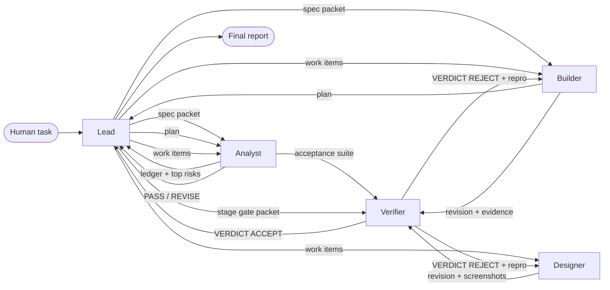

# FACTORY.md: Ledger-First Dark Factory

A five-seat software factory for Band Desktop. You give the **Lead** one task; the band
reads the specification into a numbered requirements ledger, plans against it, builds in
parallel lanes, and lets an independent **Verifier** with a veto accept or reject every
revision against gates it runs itself. Between the dispatch and the final report the band
runs unattended.

Everything here is generic. Nothing in `mandates/`, `playbook/` or `.claude/skills/`
names a product, an endpoint, a field or an error code; the task pasted into the room
(see `dispatch/`) carries all of that. We pointed it at a wallet service; you could point
it at a ticketing system, an inventory service or a scheduler without changing a line.

---

## 1. The band

| Seat | Harness | Model | Owns | Leaves to others |
|---|---|---|---|---|
| **Lead** | Claude Code | claude-opus-5-5 | stage plan, work items, routing, gates, run state, run log, final report | product code and tests |
| **Analyst** | Claude Code | claude-opus-5-5 | requirements ledger, glossary, acceptance suite, plan critique, diagnosis | product code |
| **Builder** | Claude Code | claude-opus-5-5 | the core: domain logic, storage, public interface, build, run instructions | accepting its own work |
| **Designer** | Claude Code | claude-sonnet-5-5 | everything user facing; core items when a stage has no screens | accepting its own work |
| **Verifier** | Claude Code | claude-opus-5-5 | independent checks, two-axis review, the verdict | fixing what it judges |

Mandates: [`mandates/`](mandates/). Shared rules: [`playbook/PROTOCOL.md`](playbook/PROTOCOL.md).
Factory skills, loaded by Claude Code from the repository: [`.claude/skills/`](.claude/skills/)
(`spec-ledger`, `slice-tdd`, `gate-review`, `diagnose`, `screen-craft`).



## 2. How a stage runs

1. **Carry forward.** The builder copies the last accepted stage folder, deletes nested
   version control, and commits the copy unchanged. Accepted folders are frozen.
2. **Ledger first** (Analyst, `spec-ledger`). Every constraining sentence becomes a row
   `R<stage>.<n>` with its verbatim quote and how it will be proven. The analyst hunts what
   a quick reading misses: boundaries, error order, repeated and simultaneous requests,
   time, upgrades of existing state. Judged checks are mostly hidden but all written in the
   specification, so the ledger's completeness is the stage's ceiling.
3. **Plan and critique.** The builder plans modules and where each invariant is enforced
   (one place each); the analyst scores it against the ledger, PASS or REVISE, two rounds.
4. **Parallel lanes.** The lead cuts work items with one owner, owned paths, requirement
   ids and DONE WHEN commands. The analyst writes the acceptance suite *from the ledger*;
   the builder and the designer build their items test first (`slice-tdd`,
   `screen-craft`). When a stage has no screens the designer builds core items, so the
   work stays distributed.
5. **Item review.** Each finished item goes to the verifier as a self-contained packet; the
   verifier checks it out into its own worktree, re-runs the DONE WHEN commands and the
   item's tests, reviews the diff, and answers ACCEPT or REJECT with reproducing commands.
6. **Stage gate.** On one revision the verifier runs G1 to G8 (PROTOCOL section 4): ledger
   coverage, plan, acceptance suite, every earlier suite (the chain), any checker the task
   supplies, an invariant stress run, a two-axis review of the whole stage, and every
   user-facing state at the required viewports.
7. **Record.** The lead keeps `runlog/state.md` (durable state that survives context
   compaction) and writes `runlog/stage<N>.md`: items, owners, times, verdicts, what each
   rejection caught, the gate table and wall time. Verdicts live in `reviews/`.

## 3. Stand it up (about 30 minutes)

**Prerequisites:** macOS, Linux or Windows (WSL2); Git; Docker running; Python 3.12+;
Claude Code signed in (we used a subscription); a [Band](https://app.band.ai) account;
[Band Desktop](https://docs.band.ai/band-desktop) installed with its readiness checks green
(the `band` CLI on the PATH and the `band-peer` Claude Code plugin installed). The plugin is
what wakes a seat: an @mention in the room arrives in that seat's Claude Code session as a
new turn, and `/jam` registers a session as a Band agent.

1. **Install the factory into a fresh repository** (from a clone of this repository):
   ```sh
   ./bootstrap.sh /absolute/path/without/spaces/result
   cd /absolute/path/without/spaces/result
   ```
2. **Create the five seats** as Band-owned, headless Claude Code agents (once per
   machine; re-run to re-point them at a new repository):
   ```sh
   seats/create-seats.sh --dry-run lead   # probe the runtime first, creates nothing
   seats/create-seats.sh                  # create Lead, Analyst, Builder, Designer, Verifier
   ```
   Before the first run, sign the factory's own Claude config directory in, once:
   `CLAUDE_CONFIG_DIR="$HOME/.claude-factory" claude auth login`. Seats run Claude Code
   through `seats/claude-seat.sh`, which points it at that directory, so a seat never
   inherits the operator's personal hooks, plugins, MCP servers or permission rules (our
   rehearsal showed why: personal `ask` rules stopped every container command on a
   permission dialog). The wrapper also restores a full PATH, because the daemon starts
   seats with a minimal one and the seats could not find `docker`.

   The Band daemon owns and supervises each seat's Claude Code process (no terminal to keep
   open). Each seat works in the repository, takes its model from its mandate's `Model:`
   line, has its mandate as **live-linked owner instructions**, runs in permission mode
   `auto` (routine actions approved, risky ones refused, nothing waits on a dialog), loads
   the repository's `.claude/` settings and skills, and loads only Band's own MCP relay
   (`--claude-strict-mcp-config`), not the operator's MCP servers.
2b. **Pre-flight, every time before a dispatch** (each item cost us a failed first turn):
   - `claude auth status` shows `"loggedIn": true`. Owned seats use the operator's CLI
     login; an expired session fails the first turn with an authentication error.
   - `claude --version` is new enough for the models in the mandates (`claude update`),
     then `band restart` any seat runtime started on the old binary.
   - Every seat is a participant of the room **and** bound to it (`band sessions --all`
     shows the room id per seat). A message in a room the seats are not in goes nowhere,
     silently.
3. **Create the room** in Band Desktop with a fresh name and add the five seats. (The lead's
   mandate also re-checks membership and adds any missing seat itself.)
4. **Smoke test.** Ask the lead in the room to ping each seat by handle and confirm every
   seat replied. Seats see only messages addressed to them, so this proves routing.
5. **Rehearse** on a small problem end to end (we used the event's practice track).
6. **Run.** In a *fresh* room and a *fresh* repository, paste one stage task per stage
   (ours are in [`dispatch/`](dispatch/)). Send nothing else until the lead's final report.

*Alternative seat setup:* interactive Claude Code sessions joined with the `band-peer`
plugin, one terminal per seat: `seats/start-seat.sh <seat> [extra dirs]`. Docker Sandboxes
(Band Desktop: Settings, Experiments) add isolation for unattended runs.

*Setup gotchas we hit:* the daemon may not inherit your shell's PATH, so the script pins
the `claude` executable path; `bare` context mode cannot use a Claude subscription; and with
the operator's own MCP servers loaded, Band's relay connected too slowly for the runtime
probe, hence strict MCP config.

## 4. Design choices, and what they cost

| Choice | Why | Cost |
|---|---|---|
| **Ledger before code** | The judged suite is mostly hidden but fully written in the spec. A row per sentence turns "read carefully" into an artefact with a completeness criterion that every later step cites. | A serial step at the start of each stage. |
| **Tests by a seat that does not build** | A builder testing its own work tests what it built, not what was asked. The analyst writes tests from the ledger. | Some overlap between builder unit tests and analyst acceptance tests. |
| **Verifier with a veto that never fixes** | Separating judgement from authorship makes "review changed something" real and keeps every defect visible in the room. | Every defect costs a round trip, bounded by budgets. |
| **Light item review, full stage gate** | Full gates on every item would make the verifier the queue in front of three lanes. | Some defects surface only at the stage gate. |
| **Self-contained packets** | Band seats see only messages addressed to them; a pointer is an empty handoff. Fixed headings make omissions visible. | Long messages; specifications are pasted in numbered parts. |
| **Every turn ends with a message** | Seats wake only on messages; one silent turn stalls the factory. | Some status chatter. |
| **One shared tree, path ownership, verifier worktrees** | Seats share a repository so history is one story; the verifier judges an exact revision in its own worktree, never the tree others are editing. | Commits must name their paths; occasional index lock retries. |
| **Per-seat commit authors** | History shows who did what and traces each commit to the packet it answers. | None. |
| **Durable lead state on disk** | The lead's context fills over a multi-hour run; `runlog/state.md` survives compaction. | One file write per lifecycle change. |
| **Opus on judgement seats, Sonnet on screens** | Ledger, build and verdict errors are expensive; screen work is high volume and well specified. | Opus seats dominate spend (section 7). |

## 5. How the factory catches and recovers from bad work

- **Independent re-execution.** The verifier rebuilds from scratch in its own worktree and
  re-runs every command; reported output is evidence to compare, not to trust.
- **The chain gate.** A stage folder must pass every earlier stage's acceptance suite, so
  a regression introduced while extending is caught before acceptance.
- **Anti-overfitting.** Supplied checkers are black boxes: run them, read their output,
  leave their test sources unread. The verifier's spec axis rejects code that recognises
  particular test inputs; the builder fixes rules for every input.
- **Invariant stress.** Simultaneous and repeated writes, then a read-back of every
  invariant, several times over, because a race passes once.
- **Budgets.** Three rejections per item, then the lead re-plans (split, re-assign, or
  diagnose). Three failed stage gates, or a gate red for reasons outside the band, and the
  lead records the blocker and reports the best revision instead of looping.
- **Diagnosis loop.** A failure that returns twice goes to the analyst (`diagnose`): a red
  loop first, then minimise, rank falsifiable hypotheses, and hand the owner a proven cause.
- **Liveness.** Every turn ends with a message; a silent seat gets a ping, then its packet
  again, then its item moves to another owner.
- **History that only grows.** Settings deny amend, rebase, hard reset, stash, clean and
  force push; at each stage gate the verifier proves the last accepted revision is an
  ancestor of the new one.

**A bad result it caught:** *(filled from the submitted run: quoted from `reviews/` and
the room log)*

## 6. Keeping the factory generic

`mandates/` describe roles, handoffs and rejection criteria only, and contain no
identifier-shaped tokens (no paths starting with a slash, no snake or kebab case names),
so the event's vocabulary scan has nothing to match; `harness check` passes against both
tracks' lists. Track detail lives only in the task pasted into the room. Our test: hand
these mandates to a team building something else; every sentence still applies.

## 7. Measured cost and time

Measured on the submitted run. Wall time runs from the dispatch message to the lead's
final report (room log timestamps, cross-checked with `runlog/`). Model usage comes from
Claude Code's local session logs (`npx ccusage@latest session`): each seat is its own
Claude Code session, so usage is attributed per seat by session; it is priced at API list
rates although the seats ran on a Claude subscription.

| Stage | Wall time | Work items | Rejections | Tokens (in / out) | Equivalent API cost |
|---|---|---|---|---|---|
| 1 | | | | | |
| 2 | | | | | |
| 3 | | | | | |
| 4 | | | | | |

| Seat | Share of tokens | Equivalent API cost |
|---|---|---|
| Lead | | |
| Analyst | | |
| Builder | | |
| Designer | | |
| Verifier | | |

## 8. What we tried that did not work

Design review before the first run (an independent plan critic and an adversarial
genericness review) removed these from an earlier draft:

- **A verifier that required a clean shared working tree**: with three lanes editing, the
  tree is never clean, so it would have waited forever. Replaced by per-revision worktrees.
- **Unbounded waits**: "wait for the final part", "ping a seat that has gone quiet" with no
  clock. Replaced by the end-every-turn-with-a-message rule and explicit budgets.
- **Full gates on every item**: would have made the verifier the bottleneck.
- **A designer idle in stages without screens**: one builder would have carried nearly all
  the code. The designer now takes core items.
- **Mandate wording that echoed the event's runtime table and UI rules**: generic in
  vocabulary but specific in shape; rewritten as "every constraint the specification
  states".

Rehearsal setup failures (each silent or a single error line, none caught by the seats
themselves, all now in the pre-flight list in section 3):

- **Dispatch into a room the seats were not in.** Nothing happened for an hour: no error,
  no log line. Fixed by creating the room with all seats and verifying their bindings.
- **Expired CLI login.** The first turn failed on authentication.
- **CLI older than the model required.** The first turn failed with an API error naming
  the minimum version.
- **Operator config leaking into seats.** Seats inherited the operator's personal Claude
  config, whose `ask` rules made every container command wait on a permission dialog,
  posted to the room with a mention of the human. The lead kept the run moving by
  approving or denying each request in the room (it correctly denied one that would have
  killed other seats' servers), but the right fix was isolation: seats now run with a
  factory-only config directory (`seats/claude-seat.sh`).
- **Minimal PATH for daemon-started seats.** Seats could not find `docker`; the lead
  diagnosed it and broadcast a workaround. The wrapper now restores the PATH.

*(submitted-run findings added here)*

## 9. Limitations

- Seats share one machine; port ranges and name prefixes per seat prevent collisions only
  if seats follow them.
- Opus-heavy seats are the main cost; a cheaper configuration (Sonnet builder) is untested.
- Permission mode `auto` refuses actions it judges risky; a refused action is reported, not
  retried with broader rights.

## Credits

Factory skills adapt ideas from Matt Pocock's skills (`tdd`, `diagnosing-bugs`,
`code-review`, `domain-modeling`, `writing-for-agents`; MIT licence) and from a
plan-critic / solution-verifier agency loop.
